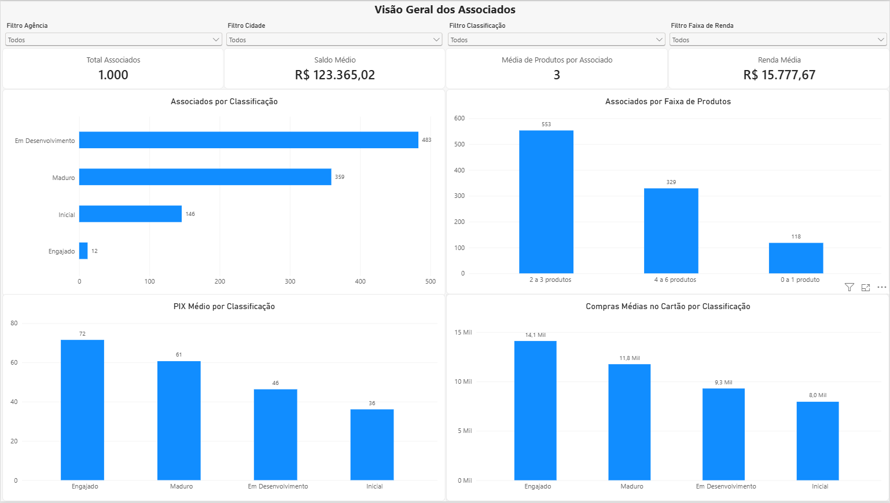
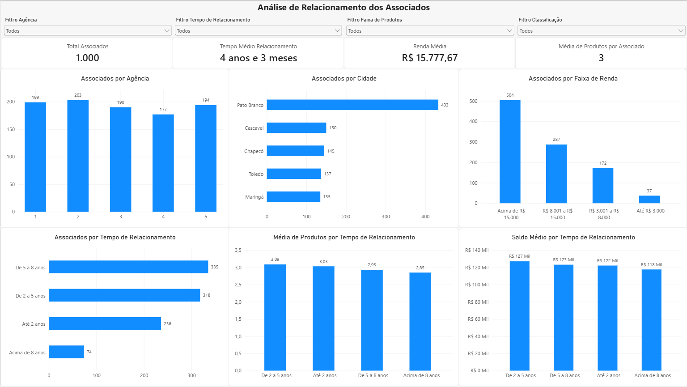
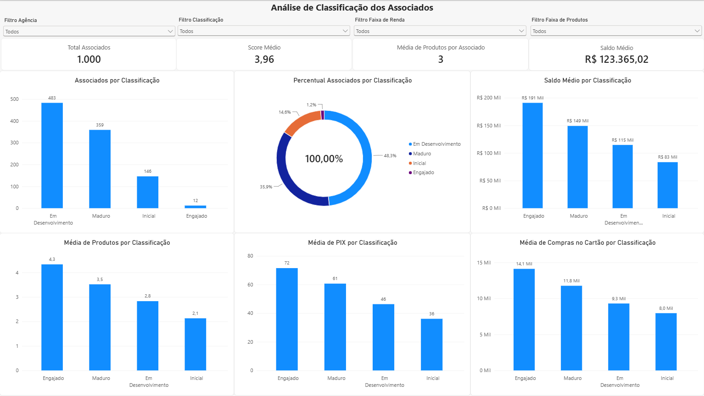
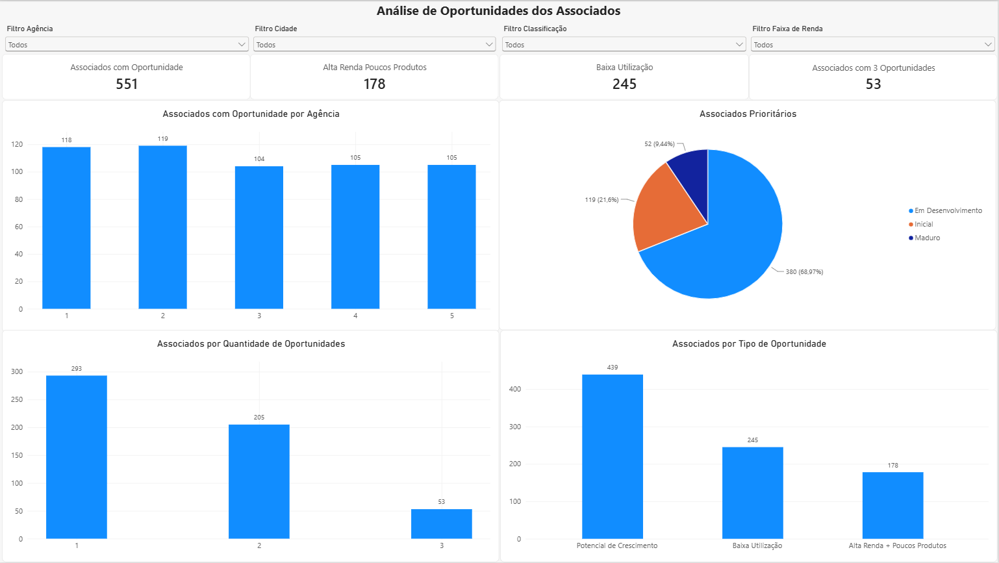

# Desafio de BI - Análise de Associados

Projeto desenvolvido como parte de um desafio técnico de BI com o objetivo de realizar o tratamento, consolidação e análise de dados de associados, produtos e movimentações financeiras.

O processamento dos dados foi desenvolvido em Python e a base resultante é utilizada como fonte para o dashboard desenvolvido no Power BI.

## Objetivo

O projeto tem como objetivo transformar as bases disponibilizadas em informações que permitam analisar o perfil e o nível de relacionamento dos associados.

As principais etapas desenvolvidas são:

- análise e validação das bases de origem;
- tratamento e padronização dos dados;
- criação de indicadores;
- consolidação das bases através da chave do associado;
- criação de uma metodologia de classificação dos associados;
- identificação de oportunidades de relacionamento;
- geração de uma base processada para utilização no Power BI.

## Tecnologias utilizadas

- Python
- Pandas
- OpenPyXL
- Git
- GitHub
- Visual Studio Code
- Power BI

## Estrutura do projeto

```text
desafio-bi/
│
├── dashboard/
│   └── Teste_BI_Dashboard.pbix
│
├── data/
│   ├── raw/
│   │   └── teste_bi_base_crua.xlsx
│   │
│   └── processed/
│       └── [arquivos gerados durante a execução]
│
├── images/
│   ├── Classificacao.png
│   ├── oportunidades.png
│   ├── relacionamento.png
│   └── visao_geral.png
│
├── src/
│   ├── main.py
│   ├── carregar_dados.py
│   ├── tratamento.py
│   ├── indicadores.py
│   ├── consolidacao.py
│   ├── classificacao.py
│   ├── oportunidades.py
│   └── exportacao.py
│
├── .gitignore
├── requirements.txt
└── README.md
```

## Bases utilizadas

O arquivo de origem possui três bases:

### Associados

Contém informações cadastrais dos associados:

- CHAVE
- NOME
- AGENCIA
- CIDADE
- DATA_ASSOCIACAO
- RENDA_MENSAL

### Produtos

Contém os produtos utilizados por cada associado:

- CONTA_CORRENTE
- CARTAO
- CREDITO
- INVESTIMENTO
- CONSORCIO
- SEGURO

### Movimentação

Contém informações relacionadas à movimentação financeira:

- SALDO_MEDIO
- PIX_MENSAL
- COMPRAS_CARTAO

As três bases são relacionadas através da coluna `CHAVE`.

## Tratamento dos dados

Durante a análise inicial foram realizadas verificações de:

- valores nulos;
- registros duplicados;
- chaves duplicadas;
- chaves nulas;
- padronização de cidades;
- consistência das datas;
- consistência dos valores numéricos.

### Renda mensal

Foram identificados valores nulos em `RENDA_MENSAL`.

Para o tratamento, os valores ausentes foram preenchidos utilizando a mediana de renda da respectiva agência.

A mediana foi escolhida por ser menos sensível a valores extremos do que a média e por preservar melhor o comportamento central da renda dos associados de cada agência.

### Cidades

Foram encontradas diferentes representações para algumas cidades, como:

- Pato Branco
- PATO BRANCO
- P. Branco

Esses valores foram padronizados para uma única nomenclatura.

Também foram ajustados nomes de cidades que necessitavam de acentuação.

### Datas futuras

Foram identificadas datas de associação posteriores à data atual.

Esses registros foram preservados na base original, porém o tempo de relacionamento não é calculado para essas ocorrências, evitando a geração de tempos negativos.

### Produtos

Os campos de produtos foram validados para garantir a consistência dos valores utilizados na identificação de posse de produtos.

### Movimentação

Foram analisados:

- saldo médio;
- quantidade mensal de PIX;
- compras no cartão.

Não foram identificados valores negativos.

Valores iguais a zero em `PIX_MENSAL` foram considerados válidos, representando associados que não realizaram transações PIX no período.

## Indicadores criados

### Quantidade de produtos

Foi criado o indicador:

`QTD_PRODUTOS`

Ele representa a quantidade total de produtos utilizados por cada associado.

### Faixa de produtos

Além da quantidade total de produtos, foi criado o indicador:

`FAIXA_PRODUTOS`

Esse indicador agrupa os associados de acordo com a quantidade de produtos utilizados, facilitando a análise do nível de utilização dos produtos da instituição.

Os associados são distribuídos nas seguintes faixas:

- 0 a 1 produto
- 2 a 3 produtos
- 4 a 6 produtos

A classificação é realizada a partir do indicador `QTD_PRODUTOS`.

O campo é utilizado nas análises do dashboard para visualizar a distribuição dos associados de acordo com a quantidade de produtos utilizados.

### Faixa de renda

Os associados foram classificados nas seguintes faixas:

- Até R$ 3.000
- R$ 3.001 a R$ 8.000
- R$ 8.001 a R$ 15.000
- Acima de R$ 15.000

### Tempo de relacionamento

O tempo de relacionamento é calculado a partir da diferença entre a data atual e a data de associação.

Foram criados dois campos:

`TEMPO_RELACIONAMENTO_MESES`

Utilizado para cálculos e regras de classificação.

`TEMPO_RELACIONAMENTO`

Utilizado para apresentação, em formato mais amigável, por exemplo:

```text
2 anos e 9 meses
6 anos e 1 mês
5 anos
```

### Faixa de tempo de relacionamento

Além dos campos utilizados para cálculo e apresentação do tempo de relacionamento, foi criado o indicador:

`FAIXA_TEMPO_RELACIONAMENTO`

Esse indicador agrupa os associados de acordo com o período de relacionamento com a instituição, permitindo comparar grupos com diferentes tempos de associação.

A classificação utiliza o campo `TEMPO_RELACIONAMENTO_MESES` e considera as seguintes faixas:

- Até 2 anos
- De 2 a 5 anos
- De 5 a 8 anos
- Acima de 8 anos

Os limites utilizados no cálculo correspondem a:

- até 24 meses;
- acima de 24 e até 60 meses;
- acima de 60 e até 96 meses;
- acima de 96 meses.

Para registros cuja `DATA_ASSOCIACAO` é posterior à data atual, o tempo de relacionamento não é calculado. Consequentemente, esses registros não recebem uma faixa de tempo de relacionamento, evitando classificações baseadas em períodos negativos.

## Consolidação das bases

As bases de Associados, Produtos e Movimentação foram consolidadas utilizando a coluna `CHAVE`.

A base de associados foi utilizada como referência principal e as demais informações foram incorporadas através de relacionamentos do tipo `left join`.

Após a consolidação, a base permaneceu com 1.000 associados.

## Classificação dos associados

Foi desenvolvida uma metodologia de pontuação para classificar os associados de acordo com seu nível de relacionamento e utilização dos serviços.

Foram considerados os seguintes critérios:

| Critério | Pontuação máxima |
|---|---:|
| Quantidade de produtos | 2 |
| Tempo de relacionamento | 2 |
| Saldo médio | 1 |
| Utilização de PIX | 1 |
| Compras no cartão | 1 |
| **Total** | **7** |

### Quantidade de produtos

- 2 ou mais produtos: +1 ponto
- 4 ou mais produtos: +1 ponto adicional

### Tempo de relacionamento

- 2 anos ou mais: +1 ponto
- 4 anos ou mais: +1 ponto adicional

O cálculo é realizado utilizando o tempo de relacionamento em meses.

### Movimentação financeira

São atribuídos pontos adicionais quando o associado apresenta:

- saldo médio igual ou superior à mediana da base;
- quantidade mensal de PIX igual ou superior à mediana da base;
- compras no cartão iguais ou superiores à mediana da base.

A utilização da mediana permite que os critérios sejam definidos de acordo com a distribuição dos próprios dados.

## Regra de classificação

A pontuação final varia entre 0 e 7 pontos.

| Score | Classificação |
|---|---|
| 0 a 2 | Inicial |
| 3 a 4 | Em Desenvolvimento |
| 5 a 6 | Maduro |
| 7 | Engajado |

A metodologia foi definida buscando manter regras simples, transparentes e reproduzíveis, considerando quantidade de produtos, tempo de relacionamento e intensidade de utilização dos serviços.

## Resultado da classificação

Na execução atual da base foram obtidos:

| Classificação | Associados |
|---|---:|
| Inicial | 146 |
| Em Desenvolvimento | 483 |
| Maduro | 359 |
| Engajado | 12 |
| **Total** | **1.000** |

## Identificação de oportunidades

Além da classificação dos associados, foram desenvolvidas regras para
identificar perfis que podem representar oportunidades de ampliação do
relacionamento e utilização dos produtos da instituição.

As regras são calculadas após a consolidação e classificação da base.

### Alta Renda + Poucos Produtos

Identifica associados com renda mensal elevada, mas que possuem poucos
produtos.

Regra:

`RENDA_MENSAL > 15000 E QTD_PRODUTOS <= 2`

Na base analisada, foram identificados **178 associados** nessa condição.

Esse grupo pode representar uma oportunidade de ampliação do relacionamento,
considerando que possui renda elevada e baixa quantidade de produtos
contratados.

### Baixa Utilização

Identifica associados cuja utilização de PIX e compras no cartão está abaixo
do comportamento mediano observado na própria base.

São calculadas as medianas de:

- `PIX_MENSAL`;
- `COMPRAS_CARTAO`.

Regra:

`PIX_MENSAL < MEDIANA_PIX E COMPRAS_CARTAO < MEDIANA_CARTAO`

Na base analisada, foram identificados **245 associados** nessa condição.

A utilização das medianas permite definir os limites de acordo com a
distribuição dos próprios dados, evitando a utilização de valores arbitrários.

### Potencial de Crescimento

Identifica associados classificados como `Inicial` ou `Em Desenvolvimento`
que apresentam renda mensal ou saldo médio acima da mediana da base.

São calculadas as medianas de:

- `RENDA_MENSAL`;
- `SALDO_MEDIO`.

Regra:

`(CLASSIFICACAO = "Inicial" OU CLASSIFICACAO = "Em Desenvolvimento")`

E:

`(RENDA_MENSAL > MEDIANA_RENDA OU SALDO_MEDIO > MEDIANA_SALDO)`

Na base analisada, foram identificados **439 associados** nessa condição.

A regra busca identificar associados que ainda se encontram nos níveis
iniciais de relacionamento, mas apresentam características financeiras que
podem indicar potencial para maior utilização dos produtos e serviços.

### Quantidade de oportunidades

Também foi criado o indicador:

`QTD_OPORTUNIDADES`

O indicador representa a quantidade de regras de oportunidade atendidas
simultaneamente por cada associado.

O cálculo considera os três sinalizadores:

- `OPORT_ALTA_RENDA_POUCOS_PRODUTOS`;
- `OPORT_BAIXA_UTILIZACAO`;
- `OPORT_POTENCIAL_CRESCIMENTO`.

Cada regra atendida adiciona uma oportunidade ao indicador.

A distribuição encontrada na base foi:

| Quantidade de oportunidades | Associados |
|---|---:|
| 0 | 449 |
| 1 | 293 |
| 2 | 205 |
| 3 | 53 |
| **Total** | **1.000** |

Dessa forma, **551 associados apresentam pelo menos uma oportunidade**.

Entre eles, **53 associados atendem simultaneamente às três regras de
oportunidade**, formando um grupo de maior prioridade para análise.

## Base processada

Ao final do processamento é gerado automaticamente o arquivo:

```text
data/processed/teste_bi_classificada.xlsx
```

Essa base contém os dados tratados, indicadores, score, classificação e
sinalizadores de oportunidades dos associados, sendo utilizada como fonte
de dados para o dashboard desenvolvido no Power BI.

O arquivo é gerado durante a execução do projeto e, por se tratar de uma
saída processada, o diretório `data/processed/` não é versionado no
repositório.

## Execução do projeto

Com o ambiente virtual ativo, execute na raiz do projeto:

```bash
python src/main.py
```

O processo realiza:

```text
Carregamento
    ↓
Validação
    ↓
Tratamento
    ↓
Criação de indicadores
    ↓
Consolidação
    ↓
Classificação
    ↓
Identificação de oportunidades
    ↓
Exportação
    ↓
Power BI
```

## Dashboard Power BI

O dashboard foi desenvolvido no Power BI utilizando como fonte a base
processada pelo pipeline Python.

A solução foi organizada em quatro páginas analíticas.

### Página 1 - Visão Geral

Apresenta uma visão consolidada dos associados, incluindo:

- total de associados;
- saldo médio;
- média de produtos por associado;
- renda média;
- associados por classificação;
- associados por faixa de produtos;
- PIX médio por classificação;
- compras médias no cartão por classificação.



### Página 2 - Relacionamento

Apresenta análises relacionadas ao perfil e tempo de relacionamento dos
associados:

- associados por agência;
- associados por cidade;
- associados por faixa de renda;
- associados por tempo de relacionamento;
- média de produtos por tempo de relacionamento;
- saldo médio por tempo de relacionamento.



### Página 3 - Classificação

Apresenta os resultados da metodologia de classificação desenvolvida no
projeto:

- total de associados;
- score médio;
- média de produtos;
- saldo médio;
- associados por classificação;
- percentual por classificação;
- saldo médio por classificação;
- média de produtos por classificação;
- média de PIX por classificação;
- média de compras no cartão por classificação.



### Página 4 - Oportunidades

Apresenta os associados identificados pelas regras de oportunidade:

- associados com pelo menos uma oportunidade;
- associados com alta renda e poucos produtos;
- associados com baixa utilização;
- associados com três oportunidades simultâneas;
- associados com oportunidade por agência;
- associados com oportunidade por classificação;
- associados por quantidade de oportunidades;
- associados por tipo de oportunidade.

As páginas possuem filtros interativos para permitir a exploração dos
dados por diferentes características dos associados.



## Principais resultados

A análise da base permitiu identificar diferentes níveis de relacionamento
entre os 1.000 associados analisados.

A maior parcela encontra-se classificada como **Em Desenvolvimento**,
representando 483 associados, seguida pelos associados classificados como
**Maduros**, com 359 registros.

A análise de oportunidades identificou **551 associados com pelo menos uma
oportunidade**, correspondendo a 55,1% da base analisada.

Entre eles, **53 associados atendem simultaneamente às três regras de
oportunidade**, formando um grupo que pode receber atenção prioritária em
ações de relacionamento.

Também foram identificados **178 associados com renda mensal superior a
R$ 15.000 e até dois produtos**, indicando potencial para ações de
ampliação do relacionamento e oferta de produtos adequados ao perfil.

## Autor

**Estéfanos Cezar**